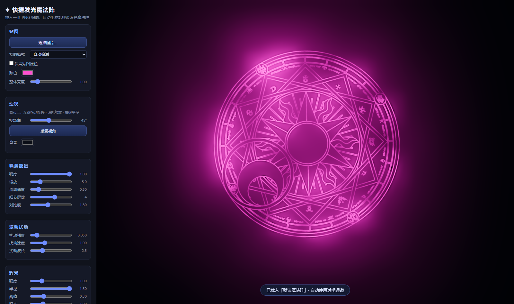
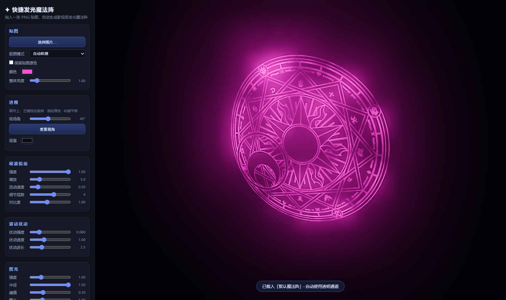
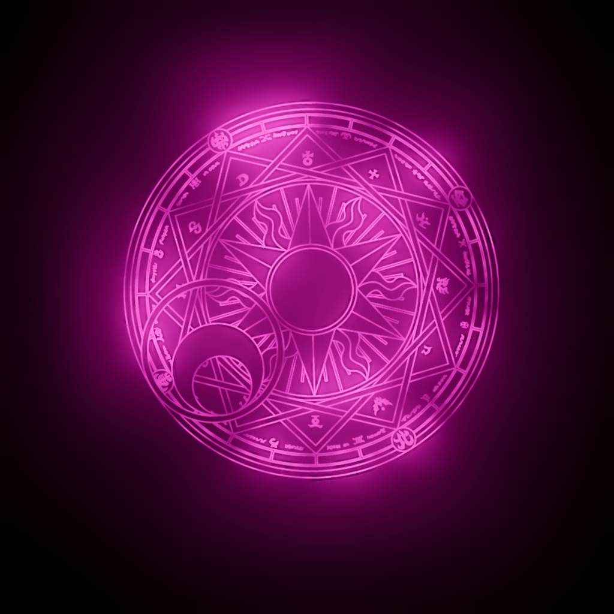

# 快捷发光魔法阵 ✦ Glowing Magic Circle

一个轻量级的纯前端小工具：拖入一张魔法阵 PNG 贴图，自动生成影视级的发光魔法阵特效，实时调节透视、噪波能量、波动扰动与辉光，一键导出素材。

灵感来自传统的 Photoshop + Blender 流程（贴图转 SVG → 三维建模 → 噪波控制发光 → 辉光合成），现在全部在浏览器里实时完成。



## 特性

- **拖入即用**：拖入 / 粘贴 / 选择 PNG、JPG、WebP 图片，自动检测抠图方式（透明通道或亮度去黑底）
- **自由透视**：鼠标拖动即可旋转、缩放、平移视角，可调视场角
- **噪波能量**：FBM 分形噪波控制魔法阵明暗流动，强度 / 缩放 / 速度 / 细节层数 / 对比度可调
- **波动扰动**：旗帜式顶点波动，让魔法阵产生轻微上下浮动的呼吸感
- **影视级辉光**：UnrealBloom + ACES 色调映射，强度 / 半径 / 阈值 / 曝光可调
- **多种导出**：
  - **PNG 黑底**：适合剪辑软件中用「滤色 / 相加」混合
  - **PNG 透明**：自动黑底转 Alpha，可直接叠加
  - **WebM 视频**：录制 3 / 5 / 10 秒循环动画
- **完全离线**：three.js 已本地化，无需联网，无需构建



## 快速开始

需要通过本地静态服务器打开（浏览器安全限制，不能直接双击 `index.html`）：

- **Windows**：双击 `启动.bat`（自动起服务器并打开浏览器）
- **任意平台**（在本目录下执行其一）：
  ```bash
  python -m http.server 8123
  # 或
  npx serve
  ```
  然后访问 http://127.0.0.1:8123/
- 也可以使用 VS Code 的 Live Server 插件等任意静态服务器

## 使用说明

1. **贴图**：拖入一张魔法阵图片（推荐带透明通道的 PNG；纯黑底的图片会自动切换为亮度抠图）。可换颜色或勾选「保留贴图原色」
2. **透视**：画布上左键旋转 · 滚轮缩放 · 右键平移
3. **噪波能量 / 波动扰动 / 辉光**：按手感拖滑块，所见即所得
4. **导出**：选择尺寸（1024 ~ 4096），点击导出按钮即可下载



## 技术原理

- **three.js**（v0.160.1，已内置于 `vendor/`，MIT 协议）
- 自定义 **GLSL 着色器**：贴图遮罩 × Simplex-FBM 能量噪波 × HDR 发光，加性混合叠加
- **顶点着色器**正弦波叠加实现旗帜式扰动
- **UnrealBloomPass** 辉光 + **ACES Filmic** 色调映射
- 透明 PNG 导出使用「黑底反预乘」算法（alpha = max(r,g,b)，颜色反预乘），亮光区域叠加时颜色准确

## 项目结构

```
├── index.html        # 页面与 UI
├── style.css         # 界面样式
├── main.js           # 渲染逻辑与着色器（核心）
├── 启动.bat           # Windows 一键启动
├── assets/           # 内置默认贴图
├── vendor/three/     # three.js 本地依赖（含其 LICENSE）
└── docs/             # README 截图
```

## 致谢

- [three.js](https://threejs.org/) — MIT License

## License

[MIT](LICENSE) © 2026 LilJoeIJOYU
